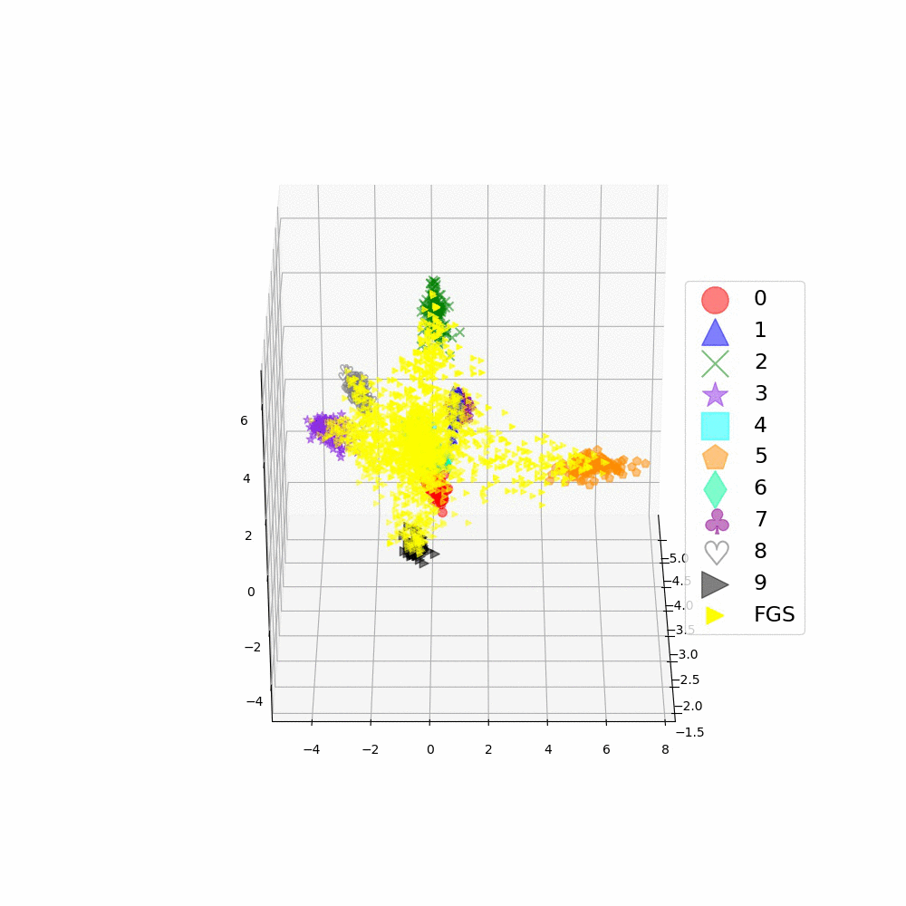

For re-producing 3D figures in our paper, titled "Out-distribution Training Confers Robustness to Deep Neural Networks ", published in (DSML)[https://dependablesecureml.github.io/2018/index.html] 2018 (co-located with 48th IEEE/IFIP International Conference on Dependable Systems and Networks).

# Summary

We argue and empirically showed that a minimally-modified vanilla CNN, which a vanilla CNN with an extra class added to its output-- call it as Augmented CNN, can be a more robust ML model through detecting **unseen OOD sets** and some types of adversarial examples, **if it is trained on an appropriate Out-of-Distribution set.** 

To show how such an A-CNN can be more robust to unknown samples (e.g. OODs ) or adversaries, we empirically demonstrate that its feature space learns more flexible representations, where OOD samples are disentangled from in-distribution sub-manifolds. In below, the feature space of 3 CNNs for a given in-distribution task (CIFAR-10) are exhibited; I) vanilla CNN; II) A-CNN* (trained a proper OOD set--CIFAR-100), and III) A-CNN (trained on an improper training OOD set--SVHN). In each row, an OOD set or a set of adversarial examples, along with the in-distribution samples, are represented in the feature spaces of these CNN. Note that how the unseen OOD samples (SVHN) and a portion of unseen adversarial examples are disentangled from the in-distribution sub-manifolds in the feature space of A-CNN*.

| OOD set      	|	Vanilla CNN	|	A-CNN* (C100)	|	A-CNN (SVHN)	|
| :------------:| :-------------------:	| :-------------------: |	:----------:	|
|**C100**| |  | 
|**SVHN**|  |  |
|**FGS**|  |  |
|**T-FGS**|  |  |

## How to recognize an OOD set is proper?
In another paper, We hypothesize that an OOD set is proper if it can cover (protect) in-distribution's sub-manifolds, then propose 3 metrics for recognizing a protective OOD set.

Please visit our another paper, published in ECAI2020, (read here)[http://ecai2020.eu/papers/1553_paper.pdf] or (watch here)[https://screencast-o-matic.com/watch/cYjhc0Gng3]. Its implemented code (in python) can be found (here)[https://github.com/mahdaneh/OOD_set_Metrics]

